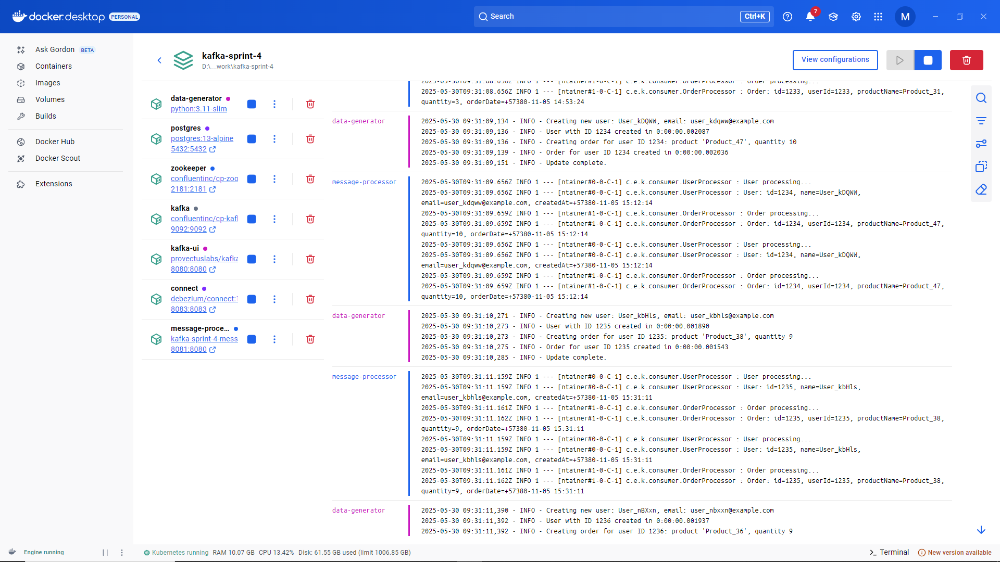
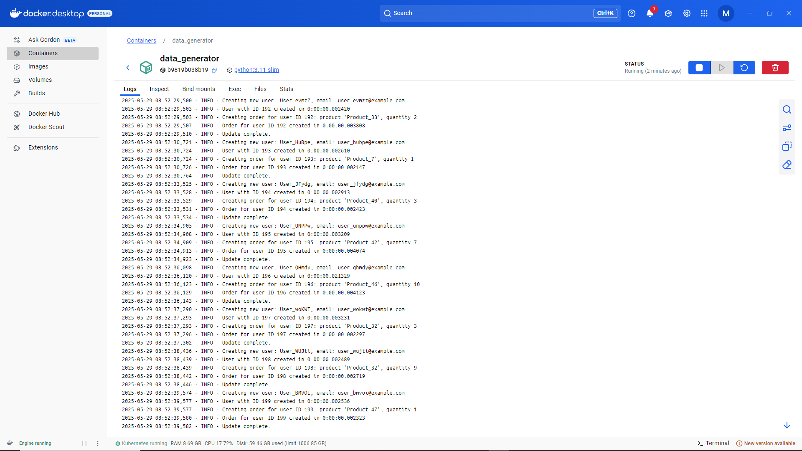
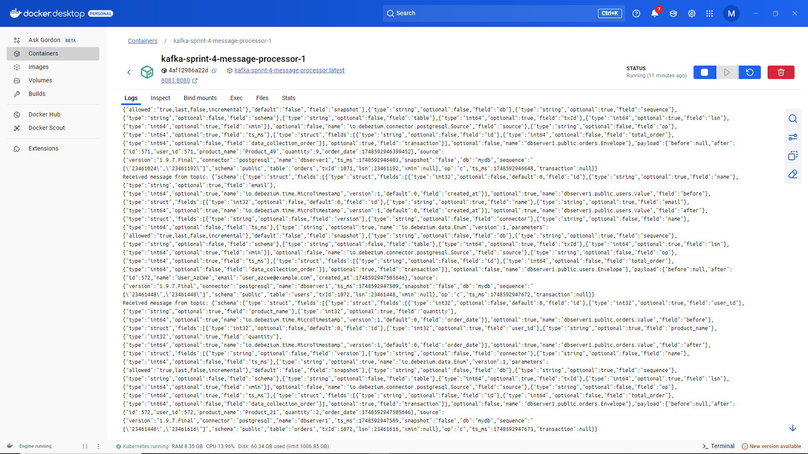
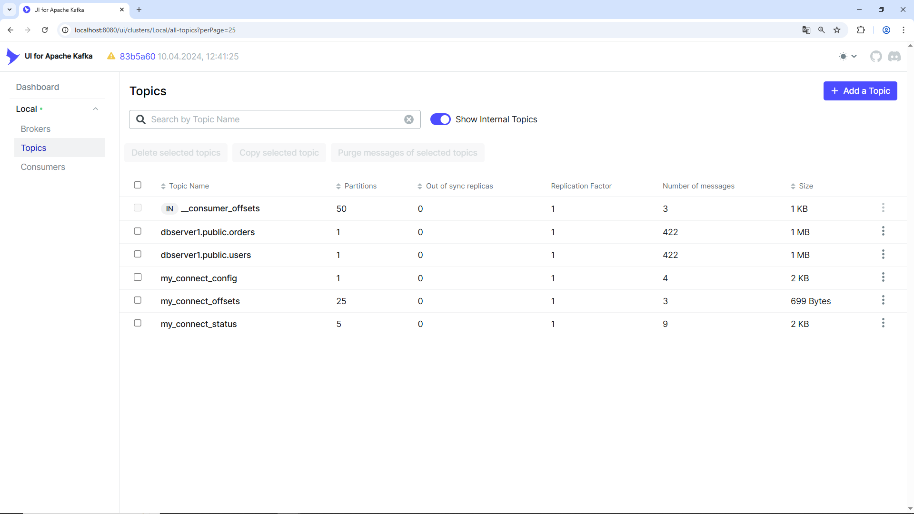
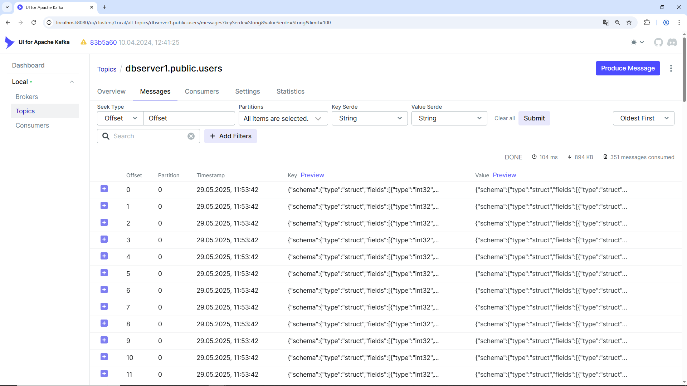

# Apache Kafka / Debezium Connector / PostgreSQL / Sprint Boot App — Change Data Capture

## Описание  

Проект демонстрирует передачу изменений данных из PostgreSQL в Apache Kafka 
с использованием Debezium Connector и механизма Change Data Capture (CDC).  

## Компоненты  

- **PostgreSQL** — база данных с таблицами `users` и `orders`.  
- **Apache Kafka & Zookeeper** — брокер сообщений.  
- **Kafka Connect с Debezium Connector** — для отслеживания изменений в базе и трансляции в Kafka.  
- **Spring Boot приложение** — потребитель Kafka, выводит сообщения в консоль.  

## Структура проекта  

```
debezium/
├── gradle/
│   └── wrapper/
│       ├── gradle-wrapper.jar
│       └── gradle-wrapper.properties
├── src/
│   └── main/
│       └── java/
│           └── com/
│               └── example/
│                   └── kafkaconsumer/
│                       ├── KafkaConsumerApplication.java
│                       ├── config/
│                       │   └── KafkaConsumerConfig.java
│                       └── consumer/
│                            ├── EntityProcessor.java
│                            ├── GenericKafkaListener.java
│                            ├── Order.java
│                            ├── OrderProcessor.java
│                            ├── User.java
│                            └── UserProcessor.java
│   └── resources/
│       └── application.yml
├── configs/
│       ├── postgresql.conf
│       ├── init-db.sql
│       ├── debezium_publication.sql
│       ├── config.json
│       ├── register-postgres-connector.sh
│       └── generate_data.py
├── images/
│   └── ...
├── build.gradle
├── settings.gradle
├── Dockerfile
├── docker-compose.yml
└── README.md
```
## Сервисы (docker-compose.yml)

Проект разворачивается в Docker с использованием Docker Compose через файл [docker-compose.yml](docker-compose.yml).  

В нём описаны ключевые компоненты, включая сервис Zookeeper для координации кластера Kafka, 
брокер Kafka для передачи сообщений, а также база данных PostgreSQL, в которой находятся таблицы `users` и `orders`. 
Для отслеживания изменений в базе и их трансляции в Kafka используется Debezium, который работает через Kafka Connect.  

Также в конфигурации определены два пользовательских сервиса: генератор сообщений на Python, 
который периодически создает и отправляет события в Kafka для тестирования, 
и процессор сообщений на Spring Boot, который потребляет данные из Kafka, обрабатывает их и выводит результаты.  

```
version: '3.8'

services:

  zookeeper:
    image: confluentinc/cp-zookeeper:latest
    ports:
      - "2181:2181"
    environment:
      ZOOKEEPER_CLIENT_PORT: 2181
      ZOOKEEPER_TICK_TIME: 2000
    healthcheck:
      test: ["CMD", "echo", "ruok", "|", "nc", "-w", "2", "localhost", "2181", "|", "grep", "imok"]
      interval: 10s
      timeout: 5s
      retries: 5

  kafka:
    image: confluentinc/cp-kafka:latest
    depends_on:
      zookeeper:
        condition: service_healthy
    ports:
      - "9092:9092"
    environment:
      KAFKA_BROKER_ID: 1
      KAFKA_ZOOKEEPER_CONNECT: zookeeper:2181
      KAFKA_ADVERTISED_LISTENERS: PLAINTEXT://kafka:9092
      KAFKA_LISTENERS: PLAINTEXT://0.0.0.0:9092
      KAFKA_OFFSETS_TOPIC_REPLICATION_FACTOR: 1
      KAFKA_TRANSACTION_STATE_LOG_MIN_ISR: 1
      KAFKA_TRANSACTION_STATE_LOG_REPLICATION_FACTOR: 1
    healthcheck:
      test: ["CMD", "bash", "-c", "echo > /dev/tcp/localhost/9092"]
      interval: 10s
      timeout: 5s
      retries: 5
    volumes:
      - kafka_data:/var/lib/kafka/data

  kafka-ui:
    image: provectuslabs/kafka-ui:latest
    ports:
      - "8080:8080"
    depends_on:
      - kafka
    environment:
      KAFKA_CLUSTERS_0_NAME: Local
      KAFKA_CLUSTERS_0_BOOTSTRAPSERVERS: kafka:9092 

  postgres:
    image: postgres:13-alpine
    container_name: postgres
    environment:
      POSTGRES_DB: mydb
      POSTGRES_USER: postgres
      POSTGRES_PASSWORD: postgres
    ports:
      - "5432:5432"
    volumes:
      - ./configs/init-db.sql:/docker-entrypoint-initdb.d/init.sql
      - ./configs/postgresql.conf:/etc/postgresql/postgresql.conf
    command: ["postgres", "-c", "config_file=/etc/postgresql/postgresql.conf"]
    healthcheck:
      test: ["CMD-SHELL", "pg_isready -U postgres"]
      interval: 10s
      timeout: 5s
      retries: 5

  connect:
    image: debezium/connect:1.9
    container_name: connect
    ports:
      - "8083:8083"
    environment:
      BOOTSTRAP_SERVERS: kafka:9092
      GROUP_ID: "1"
      CONFIG_STORAGE_TOPIC: my_connect_config
      OFFSET_STORAGE_TOPIC: my_connect_offsets
      STATUS_STORAGE_TOPIC: my_connect_status
      KEY_CONVERTER: org.apache.kafka.connect.json.JsonConverter
      VALUE_CONVERTER: org.apache.kafka.connect.json.JsonConverter
      PLUGIN_PATH: /kafka/connect
    depends_on:
      - kafka
      - postgres

  data-generator:
    image: python:3.11-slim
    container_name: data_generator
    restart: always
    volumes:
      - ./configs/generate_data.py:/app/generate_data.py
    command: >
      bash -c "
        pip install psycopg2-binary && 
        while true; do 
          python /app/generate_data.py; 
          sleep 1;
        done
      "
    environment:
      POSTGRES_HOST: postgres
      POSTGRES_DB: mydb
      POSTGRES_USER: postgres
      POSTGRES_PASSWORD: postgres

  message-processor:
    build:
      context: .
      dockerfile: Dockerfile
    depends_on:
      - kafka
    ports:
      - "8081:8080"
    environment:
      SPRING_KAFKA_BOOTSTRAP_SERVERS: kafka:9092
      KAFKA_TOPIC_USERS: dbserver1.public.users
      KAFKA_TOPIC_ORDERS: dbserver1.public.orders

volumes:
  kafka_data:
```

## Назначение каждого компонента и их взаимосвязи  

- **PostgreSQL**: Основная база данных, в которой находятся таблицы `users` и `orders`. Настроена для использования логической репликации.  

- **Debezium**: Инструмент для изменения данных в реальном времени, который отслеживает изменения в PostgreSQL и отправляет их в Kafka.  

- **Apache Kafka & Zookeeper**:  Система обмена сообщениями, в которую Debezium записывает события изменений данных. Служит в качестве шины для передачи сообщений.  

- **Spring Boot приложение**: Слушает сообщения из Kafka и обрабатывает изменения, используя логику обработки сущностей `User` и `Order`. Взаимодействует с Kafka через аннотацию `@KafkaListener`.  

### Взаимосвязи:  
- PostgreSQL реплицирует данные в Debezium.  
- Debezium отправляет события изменений в Kafka.  
- Spring Boot приложение читает сообщения из Kafka и обрабатывает их.  

## Настройки PostgreSQL  

Изменения в [postgresql.conf](configs/postgresql.conf) для отслеживания изменений данных:  

- **wal_level = logical**: Включает логическую репликацию, необходимую для работы Debezium.  

- **listen_addresses = '*'**: Позволяет принимать подключения из всех IP-адресов, что обеспечивает доступ к серверу PostgreSQL из других контейнеров.  

- **max_replication_slots = 10**: Устанавливает максимальное количество слотов репликации для отслеживания изменений.  

- **max_wal_senders = 10**: Определяет максимальное число процессов, отправляющих `WAL` (`Write Ahead Log`), позволяя обслуживать несколько клиентов.  

- **wal_keep_size = 64MB**: Указывает объем данных `WAL` для хранения, предотвращая их удаление, пока нужны активным подписчикам.   

## Инициализация данных  
   
Таблицы `users` и `orders` будут инициализированы в бд автоматически при запуске контейнера PostgreSQL, исходя из содержимого файла init-db.sql (DDL):  

```
CREATE TABLE users (
    id SERIAL PRIMARY KEY,
    name VARCHAR(100),
    email VARCHAR(100),
    created_at TIMESTAMP DEFAULT CURRENT_TIMESTAMP
);

CREATE TABLE orders (
    id SERIAL PRIMARY KEY,
    user_id INT REFERENCES users(id),
    product_name VARCHAR(100),
    quantity INT,
    order_date TIMESTAMP DEFAULT CURRENT_TIMESTAMP
);
```

## Сервис генерации данных (Python)  

Сервис [data-generator](configs/data-generator) (см. файл [generate_data.py](configs/generate_data.py)) представляет собой контейнер на базе Python, 
предназначенный для периодической генерации (раз в секунду) случайных данных пользователей и их заказов, которые 
затем вставляются в таблицы `users` и `orders` в базе данных PostgreSQL. Он используется для заполнения 
базы данных тестовыми данными, для демонстрации и тестирования работы системы в реальном времени.  

Описание сервиса в [docker-compose.yml](docker-compose.yml):  

```
  data-generator:
    image: python:3.11-slim
    container_name: data_generator
    restart: always
    volumes:
      - ./generate_data.py:/app/generate_data.py
    command: >
      bash -c "
        pip install psycopg2-binary && 
        while true; do 
          python /app/generate_data.py; 
          sleep 1; # генерации данных раз в секунду
        done
      "
    environment:
      POSTGRES_HOST: postgres
      POSTGRES_DB: mydb
      POSTGRES_USER: postgres
      POSTGRES_PASSWORD: postgres
```

## Настройки Debezium Connector  

- Файл [debezium_publication.sql](configs/debezium_publication.sql) необходим для настройки среды передачи данных, 
позволяя Debezium эффективно захватывать изменения в базовой базе данных PostgreSQL 
и отправлять их в реальном времени для последующей обработки в других системах.  

Cодержит следующие инструкции:  

`CREATE PUBLICATION debezium_publication FOR TABLE users, orders;`

Создаёт публикацию с именем debezium_publication, которая включает таблицы users и orders. 
Это позволяет Debezium отслеживать изменения данных в этих таблицах и отправлять их в систему обработки событий.  

`SELECT * FROM pg_create_logical_replication_slot('debezium_slot', 'pgoutput');`

Создаёт логический слот репликации с именем `debezium_slot`, который будет использоваться для передачи данных. 
`pgoutput` указывает на используемый формат вывода данных.  

- В файле [config.json](configs/config.json) определены основные настройки для подключения Debezium к нашей бд PostgreSQL:  

```
{
  "name": "postgres-connector",
  "config": {
    "connector.class": "io.debezium.connector.postgresql.PostgresConnector",
    "plugin.name": "pgoutput",
    "database.hostname": "postgres",
    "database.port": "5432",
    "database.user": "postgres",
    "database.password": "postgres",
    "database.dbname": "mydb",
    "schema.include.list": "public",
    "table.include.list": "public.users,public.orders",
    "database.server.name": "dbserver1",
    "slot.name": "debezium_slot",
    "publication.name": "debezium_publication",
    "tombstones.on.delete": "false"
  }
}
```
- **database.hostname**: Хост PostgreSQL сервера.  
- **database.port**: Порт, на котором слушает PostgreSQL.  
- **database.user и database.password**: Данные для авторизации в базе данных.  
- **table.include.list**: Задает таблицы, которые нужно отслеживать (users и orders).  

## Сервис обработки сообщений (Spring Boot App)  

Сервис `message-processor` представляет собой приложение Spring Boot, которое обрабатывает сообщения, поступающие из Kafka. Он предназначен для обработки изменений данных о пользователях и заказах, получаемых от Debezium, и обеспечения реагирования на эти изменения в вашей системе.  

#### Основные компоненты:  

- **Контейнер**: Сервис строится на основе [Dockerfile](Dockerfile) в текущем контексте. Он зависит от Kafka, что гарантирует правильный порядок запуска, прежде чем сервис начнет обрабатывать сообщения.  

- **Описание сервиса** в [docker-compose.yml](docker-compose.yml):  

```
  message-processor:
    build:
      context: .
      dockerfile: Dockerfile
    depends_on:
      - kafka
    ports:
      - "8081:8080"
    environment:
      SPRING_KAFKA_BOOTSTRAP_SERVERS: kafka:9092
      KAFKA_TOPIC_USERS: dbserver1.public.users
      KAFKA_TOPIC_ORDERS: dbserver1.public.orders
```

- **Порты**: Открывается порт `8081`, который маппится на порт `8080` контейнера, что позволяет взаимодействовать с приложением извне.  

- **Переменные окружения**:  
  - `SPRING_KAFKA_BOOTSTRAP_SERVERS`: Устанавливает адрес Kafka-сервера для подключения.  
  - `KAFKA_TOPIC_USERS и KAFKA_TOPIC_ORDERS`: Указывают на названия Kafka-топиков, из которых сервис будет получать сообщения.  

#### Основные функциональные возможности:  

- `GenericKafkaListener` (см. [GenericKafkaListener.java](src/main/java/com/example/kafkaconsumer/consumer/GenericKafkaListener.java)): Основной компонент, который слушает сообщения из Kafka-топиков `users` и `orders`. Он использует аннотацию `@KafkaListener` для обработки входящих сообщений.  

- `ObjectMapper`: Используется для парсинга JSON сообщений. Конфигурация включает регистрацию модуля `JavaTime` для обработки даты и времени, а также отключение использования временных штампов.  

- `EntityProcessor`  (см. [EntityProcessor.java](src/main/java/com/example/kafkaconsumer/consumer/EntityProcessor.java)): Обобщенные обработчики (например, `UserProcessor` и `OrderProcessor`) для обработки сообщений о пользователях и заказах, соответственно.  

#### Обработка сообщений:  

1. Методы:  
   - `handleUser(String message)`: Обрабатывает сообщения из топика пользователей.  
   - `handleOrder(String message)`: Обрабатывает сообщения из топика заказов.  

2. Метод `handleMessage`:  
   - Разбирает JSON-сообщение и извлекает данные.  
   - Если данные присутствуют в поле `after`, преобразует их в соответствующий объект (например, `User` или `Order`) и передаёт его в обработчик.  
   - В случае отсутствия данных в `after` логирует информацию о возможном удалении или обновлении.  

3. Обработка ошибок: Логирует исключения, возникающие во время парсинга или обработки, что помогает отслеживать возникшие проблемы в работе сервиса.  

## Запуск  

1. Запустите все сервисы:  

```
docker-compose up --build
```

2. Подключитесь к базе PostgreSQL и создайте публикацию и слот репликации:  

```
docker exec -it postgres psql -U postgres -d mydb
```

```
CREATE PUBLICATION debezium_publication FOR TABLE users, orders;
SELECT * FROM pg_create_logical_replication_slot('debezium_slot', 'pgoutput');
```

3. Зарегистрируйте Debezium connector:  

из каталога `./configs` (на основе [config.json](configs/config.json)):

```
curl -X POST -H "Content-Type: application/json" --data @config.json http://localhost:8083/connectors
```

или из каталога первого задания (то же самое):

```
curl -X POST -H "Content-Type: application/json" --data @configs/config.json http://localhost:8083/connectors
```

или (то же самое), используя скрипт:

```
./configs/register-postgres-connector.sh
```

Вывод:  

```
{
  "name": "postgres-connector",
  "config": {
    "connector.class": "io.debezium.connector.postgresql.PostgresConnector",
    "plugin.name": "pgoutput",
    "database.hostname": "postgres",
    "database.port": "5432",
    "database.user": "postgres",
    "database.password": "postgres",
    "database.dbname": "mydb",
    "schema.include.list": "public",
    "table.include.list": "public.users,public.orders",
    "database.server.name": "dbserver1",
    "slot.name": "debezium_slot",
    "publication.name": "debezium_publication",
    "tombstones.on.delete": "false",
    "name": "postgres-connector"
  },
  "tasks": [],
  "type": "source"
}
```

При повторном вызове:  

```
curl -X POST -H "Content-Type: application/json" --data @config.json http://localhost:8083/connectors
```

```
{"error_code":409,"message":"Connector postgres-connector already exists"}
```

4. Журналирование и мониторинг см. ниже.  

5. По завершении остановите приложение и запущенные сервисы:  

```
docker-compose down -v
```

## Журналирование и мониторинг  

Работу всех сервисов можно наблюдать, посредством файлов журналов (`docker logs -f <CONTAINER_ID>`) 
и при помощи Kafka UI по адресу http://localhost:8080/ui.  

При успешной работе/настройке, старте приложения (всех сервисов) можем видеть (для Windows, Docker Compose):  



В файлах журналов при этом в соответствующих сервисах  

...в сервисе генерация данных:  


 
...в сервисе потребления данных:  



Также доступен мониторинг приложения посредством Kafka UI:  






## Заключение

В результате выполнения данной практической работы была успешно настроена система передачи 
данных из базы данных PostgreSQL в Apache Kafka с использованием механизма Change Data Capture (CDC) 
через Debezium Connector. Работа охватила полный цикл — от создания таблиц в PostgreSQL и 
настройки Kafka и Kafka Connect до реализации процессов отслеживания изменений данных.